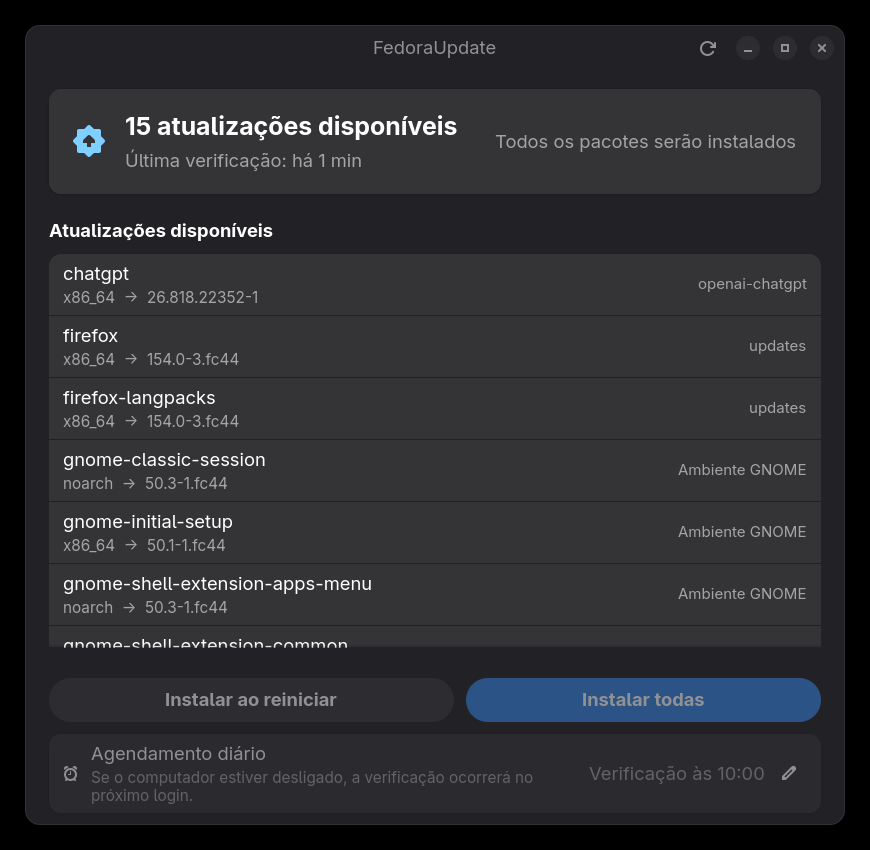

# FedoraUpdate

Aplicativo nativo para Fedora Workstation 44 que verifica atualizações com
DNF5 uma vez por dia, mostra uma lista resumida e somente instala todos os
pacotes após uma ação explícita do usuário.

## Captura de tela



> A partir da versão 0.1.1, a janela GTK 4 e o AppIndicator GTK 3 são
> compilados separadamente para impedir que as duas versões do GTK sejam
> carregadas no mesmo processo.

## Componentes

- `fedoraupdate`: janela GTK 4/libadwaita em português brasileiro.
- `fedoraupdate-tray`: AppIndicator GTK 3 com ícone `-symbolic`.
- `fedoraupdate-check`: verificador sem privilégios usado pelo timer do usuário.
- `fedoraupdate-helper`: helper mínimo executado como root pelo Polkit.
- `fedoraupdate-check.timer`: agendamento systemd persistente por usuário.

O programa nunca executa `sudo`. A verificação roda como usuário normal. Ao
clicar para instalar, o GNOME apresenta o diálogo gráfico do Polkit e, após a
autorização, o helper executa somente uma das duas transações permitidas:

```text
dnf5 --refresh upgrade -y
dnf5 --refresh upgrade --offline -y
```

## Compilar o RPM local

Instale as dependências no Fedora 44:

```bash
sudo dnf5 install cargo rust gtk4-devel libadwaita-devel \
  gtk3-devel libappindicator-gtk3-devel desktop-file-utils \
  libappstream-glib rpm-build
```

Gere o lockfile uma vez, se necessário, e construa o pacote:

```bash
cargo generate-lockfile
./scripts/build-rpm.sh
```

O RPM será colocado em `rpmbuild/RPMS/x86_64/`.

## Instalar e usar

```bash
sudo dnf5 install ./rpmbuild/RPMS/x86_64/fedoraupdate-*.rpm
gnome-extensions enable appindicatorsupport@rgcjonas.gmail.com
```

Abra **FedoraUpdate** no menu de aplicativos, escolha o horário e pressione
**Salvar horário**. O timer passa a executar diariamente e recupera uma
verificação perdida após o próximo login. O indicador inicia automaticamente
nas sessões GNOME seguintes; para iniciá-lo na sessão atual, execute
`fedoraupdate-tray`.

## Segurança

O helper privilegiado aceita apenas `online` ou `offline`, usa o caminho
absoluto `/usr/bin/dnf5`, descarta o ambiente herdado e não aceita argumentos
de pacote, repositório ou comandos arbitrários.
